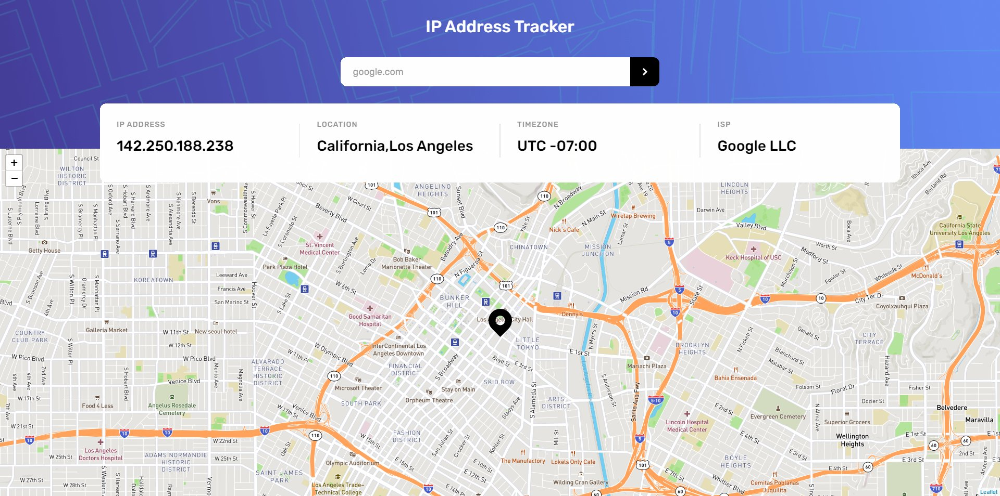

# Ip-tracker
This is project is my resolution of the Frontend Mentor [IP Address Tracker challenge](https://www.frontendmentor.io/challenges/ip-address-tracker-I8-0yYAH0)

## Overview

In this project users are able to search info about the ip, address, timezone and ISP from himself or random web-domains. Being able to see the location in the map.

### Screenshot

### Links 

- Live Site Url: [https://femiptracker.netlify.app](https://femiptracker.netlify.app)

### Built with 

- [React](https://reactjs.org)
- [Saas](https://sass-lang.com) (scss modules)
- [React Leaflet](https://react-leaflet.js.org)
- [MapBox API](https://www.mapbox.com)
- [IP Geolocation API](https://geo.ipify.org)

### What I Learned 

I learned a lot about react with this project by using the context api, dealing with useEffect and with asynchronous JS. Learned about api utilization, and a lot about css transitions and animations.

But by far the biggest challenge with this project and the thing I learned the most about was how to implement the map using Leaflet and how to implement the custom map tiles I generated with the Mapbox API.

### Things to improved

There are a few things to improve in this project, I think the main one and quite easy honestly is to add a pop-up that tells to disable any kind of addblock when using the site. Because it generates an error with the api and the data isn't fetched.
Another nice feature that could be added is an search history in the domain-ip field.
